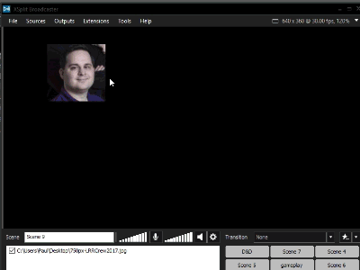
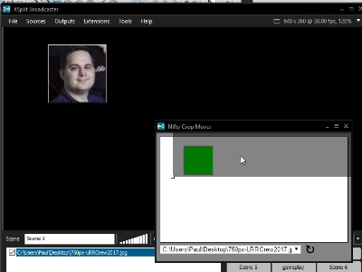

# Nifty Crop Mover
A Xsplit Extension for advance item copping flexibility

## Introduction
Given an item on the XSplit stage that has been cropped to fit a layout, this extension allows you to move and scale the item without moving its frame. It should work with any type of source (image, video, camera, html, etc.) and accurately represent items rotated in the Z axis (ie. 2D rotation) in 90° increments as well as arbitrary angles.

### Example
Without Nifty Crop Mover | With Nifty Crop Mover
-------------------|--------------
|

## Installation
1. Download or clone this repo to your local computer
2. Open XSplit
3. Go to Extensions -> Add custom extension...
4. In the Add Extension window, click browse, navigate to the `Nifty Crop Mover` folder and select `index.html`
5. Click Ok
6. In the Extensions menu, there should now be a `Nifty Crop Mover` menu item. Select that item to start the extension.

## Usage
To use the extension, simply select an item by clicking on it on the stage or in the sources list. The extension should display the frame of the selected item in green, with the area of the item that is currently cropped shown in grey. Click and drag anywhere in the grey box to change the item cropping. Click and drag on any of the four corner squares to scale the item (scaling is always proportional). You cannot move or scale the item to be within the frame. The Extension should also take into account if the item has been rotated on the Z axis (2d rotation). It *does not* currently account for X/Y axis (3D) rotation or horizonal/vertical flipping.

*Note: Due to how the XSplit API triggers events, the representation of a source in the Nifty Crop Mover extension window will not automatically update to reflect changes to the item done directly on the XSplit stage (moving, resizing, cropping, etc). To update the Nifty Crop Mover extension, simply reselect the item (by selecting something else and then selecting the item again).*

### Extra Features
##### Precise Movement
Since the Crop Mover window is smaller then the XSplit stage, 1px of mouse drag translates into a larger movement of the item on the stage. Hold down the `ctrl` key to switch to 1:1 movement of the item and the mouse.

##### Oversized items
If you scale an item past its native resolution, it will turn red to indicate that the image quality may be degraded

##### Alternate item Selection
In addition to selecting an item in the main XSplit window, you can also manually override the current item by using the drop down menu at the bottom of the extension window. This is useful if you want to adjust the cropping of an item on a different scene without switching to that scene (if you have projected that scene onto a separate monitor, for example)

##### Selecting an item in the Preview Editor
The XSplit API *does not* register item selections in the Preview Editor. In order to adjust the cropping of an item in the Preview Editor, open the preview and then click the reload arrow beside the Item Selection menu at the bottom of the extension window. Open the Item Selection menu and you should see a new **Preview** scene listed at the top.

## Possible Future Features
ie. Stuff I would like to do but don't have the time right now. If you would like to help with any of these, feel free to email me (paul@loadingreadyrun.com) or just submit a PR.
##### Refactor/Optimize Scaling and Collision Detection
I feel like there is probably a more elegant/efficient way to manage the item scaling and frame collision detection, but I don't know enough geometry.
##### Center Origin Scaling
ie. The item scales from the center when `alt/option` is held down. Fairly straight forward, but would require a redo of the frame collision detection system.
##### Handling 3d Transforms/Flipping
I've messed around with this a little but had trouble translating XSplit transformation information into css transforms.
##### OBS Compatibility
OBS also lacks the crop moving functionality that this plugin provides. In theory, the main part of the plugin could stay the same and it would just need to replace the XSplit API calls with equivalent obs-websocket events. I don't use OBS, so I haven't looked into it too much, but I would be interested if someone wanted to take this on.
